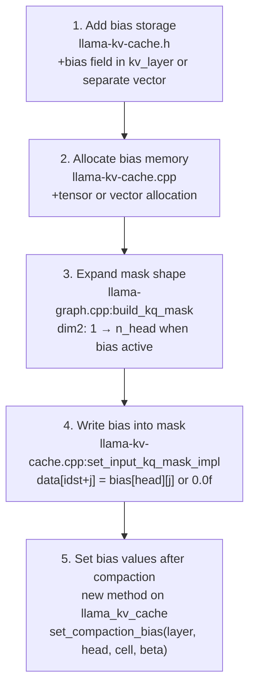
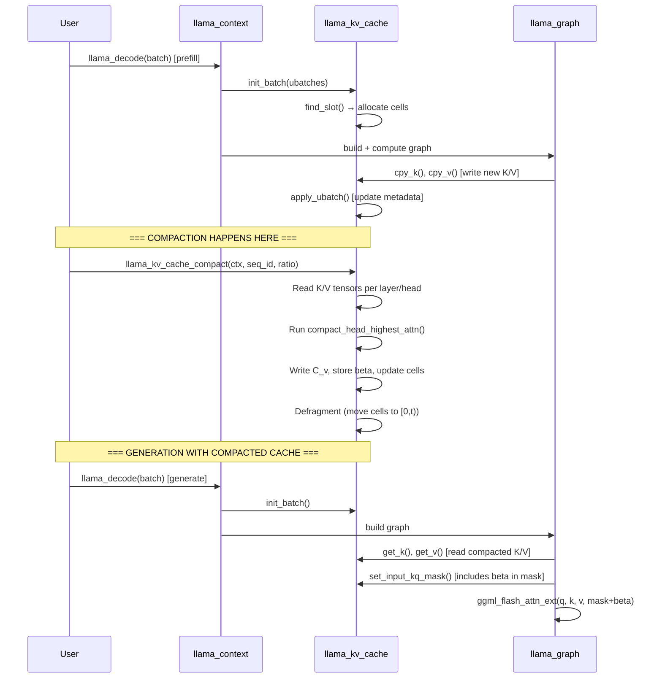

# KV Cache Compaction — Gap Analysis

What exists, what works, what doesn't, and exactly what needs to change.

---

## 1. What Already Exists

### 1.1 Documentation (Complete)

| File | Content | Status |
|------|---------|--------|
| `docs/kv-cache-compaction-attention-matching.md` | Full paper breakdown (307 lines) | Complete |
| `docs/kv-cache-compaction-algorithms.md` | Algorithm & numerical details (560 lines) | Complete |
| `docs/kv-cache-compaction-rationale.md` | Design rationale & improvement opportunities (508 lines) | Complete |
| `docs/kv-cache-compaction-user-stories.md` | 11 user stories across 5 epics | Complete |
| `docs/kv-cache-compaction-adjacent-concepts.md` | CUR decomposition, coreset, etc. | Complete |
| `docs/kv-cache-compaction-implementation-plan.md` | 7-phase implementation plan | Complete |

### 1.2 Math Library (`tools/kv-compact/kv-compact-math.h` — 378 lines)

| Function | Purpose | Status | Quality |
|----------|---------|--------|---------|
| `mat_mul_ABt()` | Q @ K^T computation | Working | Naive O(mnk), no BLAS |
| `mat_mul_AtB()` | Gram matrix / cross-terms | Working | Naive, no BLAS |
| `softmax_rows()` | Row-wise softmax with max-shift | Working | Numerically stable |
| `exp_rows_stable()` | Row-wise exp with max-shift | Working | Numerically stable |
| `nnls_solve()` | Projected gradient descent NNLS | Working | 200 iter, 1/trace step |
| `least_squares_solve()` | Regularized normal equations | Working | Gauss elim + partial pivot |
| `compact_head_highest_attn()` | Full 3-step pipeline | Working | Single head, CPU only |
| `struct compacted_head` | Result type | Working | selected_indices, beta, C_v |

**Assessment**: Math is correct and tested. Performance is adequate for Qwen3.5's
2 KV heads per layer. No BLAS dependency keeps it portable but O(n³) for large t.

### 1.3 PoC Tool (`tools/kv-compact/kv-compact.cpp` — 891 lines)

| Feature | Status | Notes |
|---------|--------|-------|
| Model load + tokenize | Working | Standard common_params |
| Prefill (fill KV cache) | Working | Standard llama_decode |
| State save/load | Working | Uses llama_state_seq_get/set_data |
| State buffer parsing | Working | Manually parses KV binary format |
| K/V tensor read helpers | Working | F32, F16, quantized (dequant) |
| K/V tensor write helpers | Working | F32, F16 only |
| Token eviction baseline | Working | Sink + recent + uniform middle |
| AM compaction (1 layer, 1 head) | Working | Runs full 3-step on extracted data |
| Quality metrics | Working | MSE, relative L2, cosine similarity |
| Generation comparison | Working | Full vs evicted output comparison |
| Reference query generation | **Simplified** | Uses K vectors as proxy, not repeat-prefill |
| Beta injection | **NOT IMPLEMENTED** | Beta computed but never injected |
| C_v writeback | **NOT IMPLEMENTED** | C_v computed but never written back |
| Multi-layer/head | **NOT IMPLEMENTED** | Only demos layer n_layer/2, head 0 |

### 1.4 Tests (`tests/test-kv-compact-math.cpp` — 582 lines)

| Test Category | Count | Coverage |
|---------------|-------|----------|
| mat_mul_ABt | 2 | Identity, rectangular |
| mat_mul_AtB | 2 | Basic, rectangular |
| softmax_rows | 4 | Sum-to-1, ordering, uniform, numerical stability |
| exp_rows_stable | 2 | Basic, large values |
| nnls_solve | 3 | Identity, non-negative constraint, overdetermined |
| least_squares_solve | 4 | Identity, overdetermined, multi-RHS, ridge |
| compact_head_highest_attn | 4 | No compression, count, quality improvement, cosine sim |
| **Total** | **21** | Core math + pipeline |

**Assessment**: Good coverage of math primitives. Missing: integration tests with
actual KV cache tensors, beta injection verification, C_v writeback round-trip.

---

## 2. KV Cache Architecture (Where Changes Are Needed)

### 2.1 `kv_layer` struct (`src/llama-kv-cache.h:206-216`)

```cpp
struct kv_layer {
    uint32_t il;                           // model layer index
    ggml_tensor * k;                       // [n_embd_k_gqa, kv_size, n_stream]
    ggml_tensor * v;                       // [n_embd_v_gqa, kv_size, n_stream]
    std::vector<ggml_tensor *> k_stream;   // per-stream K views
    std::vector<ggml_tensor *> v_stream;   // per-stream V views
};
```

**GAP**: No bias tensor. Need to add `ggml_tensor * bias` with shape
`[n_head_kv, kv_size, n_stream]` or store biases in a separate flat vector
per cell (simpler, CPU-side only).

### 2.2 Tensor allocation (`src/llama-kv-cache.cpp:102-155`)

```
K: ggml_new_tensor_3d(ctx, type_k, n_embd_k_gqa, kv_size, n_stream)  // line 138
V: ggml_new_tensor_3d(ctx, type_v, n_embd_v_gqa, kv_size, n_stream)  // line 139
```

**GAP**: Bias tensor not allocated. The ggml context's overhead calculation (line 54)
accounts for `2u*(1+n_stream)*n_layer_kv` tensors — would need to increase to `3u*...`
to add bias tensors.

### 2.3 Mask construction (`src/llama-kv-cache.cpp:1270-1414`)

The mask is set in `set_input_kq_mask_impl()`:

```cpp
// line 1402-1410:
if (alibi) {
    data[idst + j] = -std::abs(p0 - p1);
} else {
    data[idst + j] = 0.0f;  // ← THIS IS WHERE BETA GOES
}
```

**GAP**: No mechanism to add per-key bias. The mask is `[n_kv, n_tokens/n_stream, 1, n_stream]`
with dim 2 = 1 (broadcast across heads).

**CRITICAL FINDING**: The flash attention kernel (`ggml/src/ggml-cpu/ops.cpp:8216`)
indexes the mask as:

```cpp
mp = mask->data + iq1*mask->nb[1] + (iq2 % mask->ne[2])*mask->nb[2] + (iq3 % mask->ne[3])*mask->nb[3]
```

The `(iq2 % mask->ne[2])` means: if `mask->ne[2] == n_head`, each head gets its own
mask row. If `mask->ne[2] == 1`, it broadcasts. **The kernel already supports per-head
masks without any modification.**

Then at line 8250: `s += mv;` — the mask value is added to the KQ score before softmax.

**This means beta injection requires ZERO ggml kernel changes.** Just:
1. Change mask shape from `[n_kv, n_tps, 1, n_stream]` to `[n_kv, n_tps, n_head, n_stream]`
2. Store `beta[head][kv_pos]` in the mask during `set_input_kq_mask()`

### 2.4 Mask creation in graph (`src/llama-graph.cpp:22-32`)

```cpp
static ggml_tensor * build_kq_mask(...) {
    return ggml_new_tensor_4d(ctx, GGML_TYPE_F32, n_kv, n_tokens/n_stream, 1, n_stream);
    //                                                                     ^
    //                                            THIS 1 BECOMES n_head WHEN BIAS IS ACTIVE
}
```

**GAP**: Mask is always created with dim 2 = 1. Need conditional expansion.

### 2.5 State serialization (`src/llama-kv-cache.cpp:1773-1869`)

**Format**: Per-layer K data, then per-layer V data (or transposed V).
**GAP**: No bias data in serialized state. Would need to add bias section after V data.

### 2.6 Cell metadata (`src/llama-kv-cells.h`)

**GAP**: No per-cell bias storage. Cells track pos, seq, shift, ext — but not
compaction bias. Two options:
- Add `std::vector<float> bias` to `llama_kv_cells` (per-head, per-cell)
- Store bias in the dedicated bias tensor in `kv_layer`

---

## 3. Critical Path: What Must Change for Beta Injection

### 3.1 Minimal Changes (5 files, ~100 lines)



### 3.2 Design Decision: Bias Storage

**Option A: ggml tensor in kv_layer** (GPU-compatible)
- `ggml_tensor * bias` shape `[n_head_kv, kv_size, n_stream]`, type F32
- Pro: Can be kept on GPU for future GPU-side compaction
- Con: Requires ggml allocation changes, more memory

**Option B: CPU-side vector** (simpler)
- `std::vector<float> bias` in `llama_kv_cache`, shape `[n_layer][n_head_kv * kv_size]`
- Pro: Simple, no ggml changes, bias is only needed during mask construction (CPU)
- Con: Not GPU-resident; but mask construction is CPU-side anyway

**Recommendation: Option B for initial implementation.** The mask is always constructed
on CPU (`set_input_kq_mask` runs on CPU, writes to CPU tensor that's later transferred).
Bias values are small (1 float per compacted key per head) — negligible memory.

### 3.3 GQA Consideration

With GQA (Qwen3.5-35B-A3B has 2 KV heads but more query heads), each KV head serves
multiple query heads. Beta is per-KV-head, not per-query-head. When writing beta into
the mask:

```
For query head h:
    kv_head = h / n_gqa
    mask[kv_pos][token][h] = bias[layer][kv_head * kv_size + kv_pos]
```

The `(iq2 % mask->ne[2])` in the kernel handles this correctly if mask dim 2 = n_head
(query heads), with the same beta value replicated across the GQA group.

---

## 4. Critical Path: What Must Change for C_v Writeback

### 4.1 Direct tensor write path

The PoC already has `write_v_head()` / `write_k_head()` that use
`ggml_backend_tensor_set()`. These work correctly for F32 and F16.

**What's missing**: Integration with cell metadata. After writing C_v:
1. Evicted cells must be marked empty: `cells.rm(idx)`
2. Remaining cells must be defragmented to positions [0, t)
3. The ring buffer head `v_heads[stream]` must be updated

### 4.2 Alternative: Use state_seq_set_data()

Instead of direct tensor writes, compact the state buffer:
1. Save state → buffer
2. Parse buffer, run compaction on extracted K/V
3. Build new buffer with compacted K/V + C_v + fewer cells
4. Load compacted state via `llama_state_seq_set_data()`

**Pro**: Uses existing tested serialization path.
**Con**: Extra copy; but state buffers are small after compaction.

**Recommendation**: Direct tensor write for K (just keep selected rows), direct write
for C_v, then update cell metadata. Avoid the state save/load round-trip.

---

## 5. PoC Code Quality Assessment

### 5.1 What's correct and can be reused

| Component | Reusable? | Notes |
|-----------|-----------|-------|
| `compact_head_highest_attn()` | Yes | Core algorithm is correct |
| `read_k_head()` / `read_v_head()` | Yes | Handles F32, F16, quantized, v_trans |
| `write_k_head()` / `write_v_head()` | Yes | F32, F16 |
| Math primitives (softmax, NNLS, LS) | Yes | Tested, numerically stable |
| State buffer parsing | Partially | Correct but fragile; should use internal API instead |

### 5.2 What needs fixing

| Issue | Location | Fix |
|-------|----------|-----|
| Double-scaling bug | kv-compact-math.h:354-358 | Scores already scaled by inv_sqrt_dk, but X computation scales again. The code catches this (line 358 overwrites line 355) but the dead code is confusing. |
| K-as-query proxy | kv-compact.cpp:301-318 | Reference queries should be actual Q vectors, not K vectors. K and Q share structure but aren't identical after projection. |
| Single layer/head | kv-compact.cpp:714 | Only demos on `n_layer/2`, head 0. Trivial to fix with a loop. |
| No actual beta injection | kv-compact.cpp:393-396 | Comments acknowledge this gap. Beta is computed and reported but never affects generation. |
| State buffer parsing | kv-compact.cpp:566-710 | Manually parses binary format. Fragile against format changes. Should use internal KV cache API with direct tensor access. |

### 5.3 Score scaling confusion (detail)

```cpp
// Line 282-287: scores computed and scaled
scores[i] *= inv_sqrt_dk;  // scores = Q @ K^T / sqrt(d_k)

// Line 354-358: X computation
X[i * t + j] = scores[i * T + selected[j]] * inv_sqrt_dk + result.beta[j];
// BUG: double-scaling! scores already includes inv_sqrt_dk
// Fixed on next line:
X[i * t + j] = scores[i * T + selected[j]] + result.beta[j];
// This overwrites the wrong value. Should delete line 355.
```

---

## 6. Architecture Integration Points

### 6.1 Where compaction fits in the inference pipeline



### 6.2 Thread safety

Compaction modifies KV cache tensors and cell metadata. It must not run
concurrently with `llama_decode`. The API should either:
- Block until ongoing decode completes, or
- Be documented as requiring exclusive access

### 6.3 Position handling after compaction

After compaction, the kept cells retain their original positions. New tokens
during generation get `pos = max_pos + 1, max_pos + 2, ...`. RoPE uses these
positions, so they must be preserved correctly.

The gap between compacted positions (e.g., [0, 5, 12, 30, ...]) and new
positions is fine — RoPE is position-based, not index-based. The mask already
handles non-contiguous positions via `cells.pos_get(j)`.

---

## 7. Qwen3.5-35B-A3B Specific Considerations

| Parameter | Value | Impact |
|-----------|-------|--------|
| KV heads | 2 per layer | Only 2 independent compaction problems per layer — extremely cheap |
| Query heads | 32 per layer (GQA ratio 16:1) | Each KV head serves 16 query heads — abundant reference queries |
| Head dimension | 128 | t×128 matrix for LS solve — fine for CPU |
| Layers | ~64 (MoE) | 64 × 2 = 128 total compaction problems |
| Active params | ~3B per token | Weight-bound, not KV-bound after compaction |

With 2 KV heads, the compaction math is trivial:
- NNLS: 2 problems of size [n_q × t] per layer
- LS: 2 problems of size [n_q × t] × [t × 128] per layer
- Total per-layer: < 1ms for t < 500

---

## 8. Summary: Priority-Ordered TODO

| Priority | Task | Files | Lines (est.) |
|----------|------|-------|-------------|
| **P0** | Add bias storage (CPU vector) | llama-kv-cache.h, .cpp | ~30 |
| **P0** | Expand mask to per-head when bias present | llama-graph.cpp | ~15 |
| **P0** | Write beta into mask in set_input_kq_mask | llama-kv-cache.cpp | ~20 |
| **P0** | API to set bias values after compaction | llama-kv-cache.h, .cpp | ~20 |
| **P1** | C_v writeback via direct tensor writes | llama-kv-cache.cpp | ~40 |
| **P1** | Cell metadata update after compaction | llama-kv-cache.cpp | ~30 |
| **P1** | All layers/heads compaction loop | tools/kv-compact/kv-compact.cpp | ~30 |
| **P2** | Fix double-scaling bug in PoC | kv-compact-math.h | ~2 |
| **P2** | True repeat-prefill query generation | kv-compact.cpp | ~50 |
| **P2** | Non-uniform head budgets | new file | ~100 |
| **P3** | Library API in llama.h | include/llama.h, src/ | ~80 |
| **P3** | Online compaction trigger | llama-kv-cache.cpp | ~50 |
| **P3** | State serialization for bias | llama-kv-cache.cpp | ~40 |

**Total for P0 (beta injection): ~85 lines across 3 files.**
**Total for P0+P1 (working compaction): ~170 lines across 4 files.**
