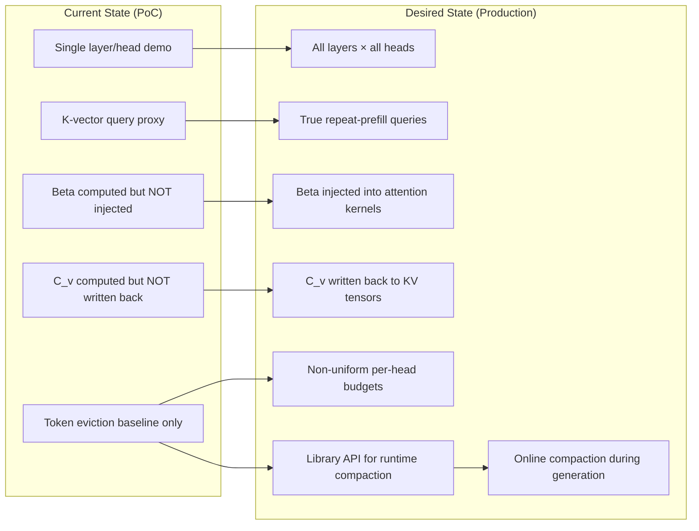
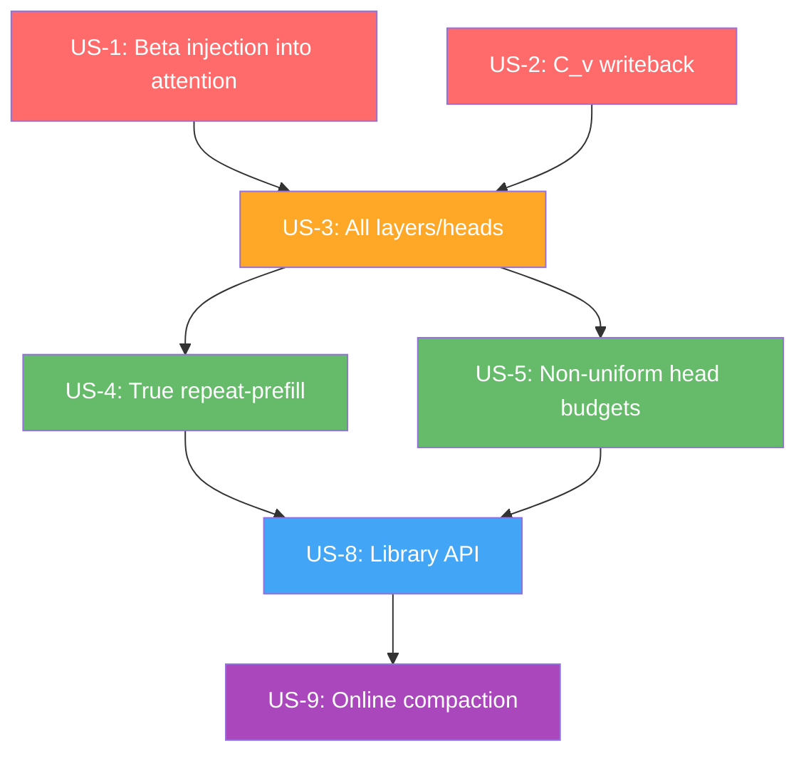

# KV Cache Compaction — Implementation Plan

## Current State → Desired State



## Critical Path



**Red = blocking, must do first. Orange = unlocks real testing. Green = quality. Blue = integration. Purple = endgame.**

---

## Phase 1: Beta Injection (US-1) — THE Critical Piece

Without beta injection, the compacted cache produces wrong attention mass ratios, making
all downstream generation incorrect. This is the #1 blocker.

### Architecture Decision: Where to inject beta

Three options analyzed:

| Option | Mechanism | Pros | Cons |
|--------|-----------|------|------|
| **A: ggml_flash_attn_ext bias** | Add per-key bias tensor to flash attention op | Clean, fast, works on all backends | Requires modifying ggml core + every backend |
| **B: Pre-softmax score modification** | Add bias to KQ scores in non-flash path | Simpler, only touches llama-graph.cpp | Only works on non-flash path; flash path bypasses |
| **C: Store bias in K vectors** | Absorb beta into K by adjusting K magnitudes | No kernel changes needed | Mathematically approximate; breaks with RoPE |

**Recommendation: Option A** — `ggml_flash_attn_ext` already accepts a mask tensor. We
extend it to accept an optional per-key bias tensor, or encode biases into the mask.

### Implementation Steps

#### 1a. Bias storage in KV cache (`llama-kv-cache.h`)

Add per-layer, per-stream bias tensors to `kv_layer`:

```
Files: src/llama-kv-cache.h, src/llama-kv-cache.cpp
```

- Add `ggml_tensor * bias` to `kv_layer` struct (shape: `[n_head_kv, kv_size]`)
- Allocate bias tensors alongside K/V in constructor
- Initialize to zero (no bias = standard attention)
- Add `get_bias(ctx, il)` to memory context for graph access

#### 1b. Bias injection into attention graph (`llama-graph.cpp`)

Modify `build_attn()` to add bias to attention scores:

```
File: src/llama-graph.cpp
```

- In the flash attention path: fold bias into `kq_mask` by adding bias values
  to the mask at corresponding positions. The mask is already added to scores
  before softmax, so `mask[q][k] += bias[head][k]` achieves the same effect.
- In the non-flash path: add bias to `kq` scores after `ggml_mul_mat(k, q)`
  and before softmax.
- Both paths: only add bias when `has_compaction_bias` flag is set (zero cost
  for non-compacted contexts).

#### 1c. Mask-based bias injection detail

The attention mask in llama.cpp is `[n_kv, n_tokens, n_head]` (or broadcast).
For compacted positions, we add `beta[head][kv_pos]` to the mask value.

```
set_input_kq_mask() modification:
  For each cell that has a compaction bias:
    mask[kv_idx][token_idx] += bias[head_idx][kv_idx]
```

This is the cleanest approach because:
- No ggml kernel changes required
- Works with both flash and non-flash paths
- Mask is already per-head capable
- Zero overhead when no bias is stored

---

## Phase 2: C_v Writeback (US-2)

Write the least-squares-optimized values back into the V cache tensors.

### Implementation Steps

#### 2a. Direct tensor writes

```
Files: tools/kv-compact/kv-compact.cpp (already has write_v_head helper)
       src/llama-kv-cache.h (new public method)
```

- Expose `set_kv_data(layer, head, positions, k_data, v_data, bias_data)` on
  `llama_kv_cache`
- Handles F32 and F16 type conversion
- Handles V-transpose layout
- Validates positions are within bounds

#### 2b. Cell metadata update

After compaction, the cache has fewer active cells:

```
File: src/llama-kv-cache.cpp
```

- Mark removed cells as empty: `cells.rm(idx)` for evicted positions
- Compact remaining cells to positions [0, t): move data + update metadata
- Update `v_heads` to point past the compacted region
- Defragmentation: use the existing `mv()` cell operation (currently disabled)

---

## Phase 3: Full Model Compaction (US-3)

#### 3a. All layers × all heads loop

```
File: tools/kv-compact/kv-compact.cpp → src/llama-kv-compact.cpp (new)
```

- Iterate `n_layer` × `n_head_kv`
- Each (layer, head) is independent → parallelize with thread pool
- For Qwen3.5-35B-A3B with 2 KV heads: only 2 heads per layer, very cheap
- Collect all `compacted_head` results, then apply in bulk

#### 3b. Unified cell update

After all heads are compacted:

- Determine global set of kept positions (intersection across heads, or
  per-head if non-uniform budgets are used)
- Update cell metadata once for all layers
- Write K, V, and bias data for all layers

---

## Phase 4: Reference Query Generation (US-4)

#### 4a. True repeat-prefill

```
File: src/llama-kv-compact.cpp
```

- After initial prefill of context, run a second prefill pass
- Input: `"{context} Repeat the previous context. {context}"`
- Extract Q vectors from the second pass (they attended to the full context)
- Store per-layer, per-head reference queries
- This doubles prefill cost but dramatically improves compaction quality

#### 4b. Query extraction hook

```
File: src/llama-graph.cpp
```

- Add optional callback/buffer to capture Q tensors during forward pass
- Only active during the repeat-prefill phase
- Store in CPU memory for compaction math

---

## Phase 5: Non-uniform Head Budgets (US-5)

**Most impactful component per paper ablations.**

#### 5a. Sensitivity profiling (one-time per model)

```
File: tools/kv-compact/kv-compact-profile.cpp (new tool)
```

- For a small calibration dataset:
  - Compact each head independently at several ratios
  - Measure reconstruction error per head
  - Build sensitivity curves
- Save as JSON: `{model_id: {layer_head: [ratio, error] pairs}}`

#### 5b. Budget allocation algorithm

```
File: src/llama-kv-compact.cpp
```

- Load sensitivity profile for current model
- Given total budget, run greedy exchange:
  - Start uniform
  - Iteratively move budget from least-sensitive to most-sensitive heads
  - Until no swap improves predicted total loss
- Output: per-head token budgets

---

## Phase 6: Library API (US-8)

```
File: include/llama.h
```

```c
// Compact the KV cache for a sequence
// Returns the number of tokens after compaction
int32_t llama_kv_cache_compact(
    struct llama_context * ctx,
    llama_seq_id           seq_id,
    float                  target_ratio,    // 0.0-1.0, fraction to keep
    struct llama_compact_params params
);

struct llama_compact_params {
    int32_t  n_ref_queries;    // 0 = auto
    bool     use_repeat_prefill;
    bool     use_nonuniform_budgets;
    const char * budget_profile_path;  // NULL = uniform
};

struct llama_compact_params llama_compact_params_default(void);
```

---

## Phase 7: Online Compaction (US-9)

```
File: src/llama-kv-cache.cpp
```

- Monitor cache usage during generation
- When cache fills to threshold (e.g., 90%):
  1. Pause generation
  2. Run compaction at 50% ratio
  3. Resume generation
- Paper demonstrates 6 consecutive compressions without quality loss
- Critical for agent workloads where tool outputs consume significant context

---

## Implementation Order & Dependencies

```
Phase 1a (bias storage)        ─┐
Phase 1b (bias in attention)    ├─→ Phase 3 (all layers/heads) ─→ Phase 6 (API)
Phase 1c (mask-based bias)      │                                      │
Phase 2a (C_v writeback)       ─┤                                      v
Phase 2b (cell metadata)       ─┘                               Phase 7 (online)
                                     Phase 4 (repeat-prefill) ─→ Phase 6
                                     Phase 5 (head budgets)   ─→ Phase 6
```

Phases 1+2 are blocking. Phases 4+5 can be developed in parallel after Phase 3.

---

## File Change Summary

| File | Changes |
|------|---------|
| `src/llama-kv-cache.h` | Add bias tensors to kv_layer, add compact/set_kv_data methods |
| `src/llama-kv-cache.cpp` | Allocate bias tensors, implement compact methods, cell metadata updates |
| `src/llama-graph.cpp` | Add bias to attention mask in `set_input_kq_mask()` |
| `src/llama-kv-compact.h` | New: compaction algorithm interface |
| `src/llama-kv-compact.cpp` | New: full compaction implementation (moved from tools/) |
| `include/llama.h` | New API: `llama_kv_cache_compact()`, params struct |
| `tools/kv-compact/kv-compact.cpp` | Update to use new internal API |
| `tools/kv-compact/kv-compact-profile.cpp` | New: sensitivity profiling tool |
| `tests/test-kv-compact-math.cpp` | Extend with integration tests |

---

## Risk Assessment

| Risk | Mitigation |
|------|------------|
| ggml_flash_attn_ext doesn't support per-key bias | Use mask-based injection (already the recommendation) |
| V-transpose layout complicates writeback | write_v_head helper already handles this in PoC |
| Quantized KV types lose precision on round-trip | Defer to Phase 7; F16 is the primary target |
| Compaction latency blocks generation | Run compaction on separate thread; async API |
| Cross-head position inconsistency | Use same selected positions across heads (option), or support per-head variable cache sizes |

---

## Success Criteria

1. **Correctness**: Compacted cache with beta + C_v produces attention outputs with
   cosine similarity > 0.999 vs full cache (per paper benchmarks)
2. **Performance**: Compaction of 4k context at 20% ratio completes in < 1 second on
   target hardware (CPU-side math, 2 KV heads per layer)
3. **Throughput**: With 50x compaction, single-stream generation throughput increases
   measurably (KV cache bandwidth savings)
4. **Quality**: Perplexity degradation < 0.5 at 5x compression, < 2.0 at 20x compression
